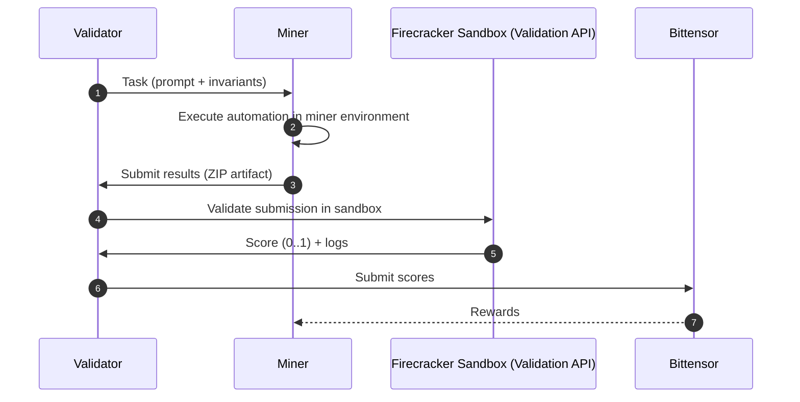

# AlphaCore – Autonomous DevOps Agent Network

AlphaCore is a Bittensor subnet aimed at becoming a decentralized marketplace for autonomous DevOps agents. Miners compete by completing real tasks, while validators verify outcomes and score performance in a trust-minimized way.

Today, the repo focuses on **Terraform-based tasks on Google Cloud (GCP)** validated in a locked-down sandbox. This is just the starting point: the architecture is intended to expand to additional clouds, decentralized providers, and task types beyond Terraform generation over time.

## Readmes

- [`VALIDATOR.md`](VALIDATOR.md) — run the validator neuron (task dispatch).
- [`VALIDATOR-API.md`](VALIDATOR-API.md) — run the Firecracker-backed sandbox Validation API (used by the validator to score miner submissions).
- [`MINER.md`](MINER.md) — run the example miner and build your own miner entrypoint.

## High-Level Overview

AlphaCore is designed for autonomous agents that can:

- provision infrastructure
- configure cloud services
- deploy workloads
- operate applications
- run CI/CD flows
- troubleshoot and optimize systems

Validators score work by verifying:

- real system state (cloud/application)
- workflow results
- compliance/correctness
- performance and efficiency

## Security Philosophy

This repo is actively evolving. The current implementation emphasizes sandboxing untrusted miner submissions; future iterations can broaden verification methods.

- **Miners execute automation**: miners interpret tasks, execute against their own environments and produce a submission artifact.
- **Validator-side sandboxing for untrusted inputs (today)**: untrusted inputs (e.g., a miner’s Terraform submission) are processed inside Firecracker microVMs to verify their integrity with strict egress controls.
- **Outcome-focused scoring**: tasks include machine-checkable requirements (“invariants”) that are validated against outputs (today: typically `terraform.tfstate`).

For details on the current sandbox model, see [`VALIDATOR-API.md`](VALIDATOR-API.md).

## Execution Sequence

## Roadmap

AlphaCore is intended to expand beyond the current “Terraform + sandbox validation” focus:

- additional clouds and providers (beyond GCP, decentralized)
- open source
- task types beyond Terraform generation (configuration, deployments, ops workflows, etc.)
- stronger provenance / attestation mechanisms as the protocol evolves

## Repo Layout (high level)

- `neurons/` — starter validator and miner implementations.
- `subnet/` — protocol + bittensor configuration + validator/miner base classes.
- `modules/` — task generation and the sandboxed validation stack.
- `scripts/` — operational scripts (PM2 launchers, setup helpers).
- `logs/` — PM2 logs and validation artifacts (submissions/logs).
